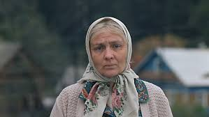
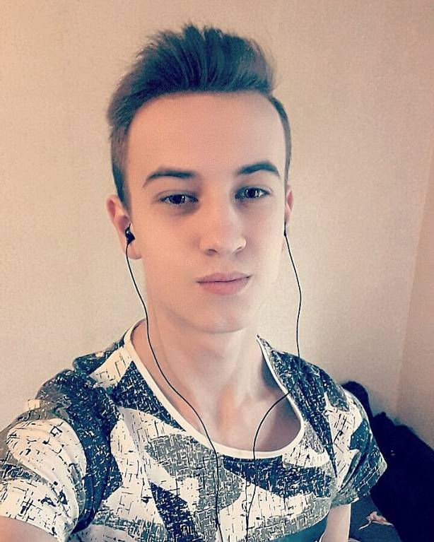

# Персонажи

## 1. Ключевые персонажи

### Персонаж 1: Алексей, 25 лет
- 
- **Цели**: Покупка редких видеоигр со скидками, поиск новых предложений в категории инди-игр.
- **Социальное положение**: Программист, средний уровень дохода.
- **Описание рабочего процесса**: Работает удалённо, свободное время тратит на видеоигры, изучение новинок, покупку игр по скидкам.
- **Описание окружения**: Живёт в квартире, пользуется настольным компьютером с двумя мониторами.
- **Уровень подготовки**: Высокий уровень цифровой грамотности, активный пользователь интернет-магазинов.
- **Неудовлетворённости и ожидания**: Разочарование при отсутствии персонализированных рекомендаций. Ожидает быстрых предложений со скидками и уведомлений о них.
- **Художественные элементы**: Увлечён новыми технологиями, любит инди-игры и киберспорт.

### Персонаж 2: Ольга, 30 лет
- 
- **Цели**: Поиск образовательных видеоигр для детей, покупка безопасного контента.
- **Социальное положение**: Мать двоих детей, средний уровень дохода.
- **Описание рабочего процесса**: Занимается домом, использует интернет-магазины для поиска качественных детских игр.
- **Описание окружения**: Работает с ноутбуком в домашних условиях.
- **Уровень подготовки**: Средний уровень компьютерной грамотности.
- **Неудовлетворённости и ожидания**: Разочарование при отсутствии категорий для детских игр, ожидает простоты и ясности интерфейса.
- **Художественные элементы**: Стремится к развитию детей через видеоигры.

### Персонаж 3: Иван, 22 года
- 
- **Цели**: Поиск эксклюзивных игр для консоли, покупка DLC и коллекционных предметов.
- **Социальное положение**: Студент, низкий доход.
- **Описание рабочего процесса**: Активный игрок, изучает предложения и покупки игр по подписке.
- **Описание окружения**: Пользуется игровой консолью и смартфоном.
- **Уровень подготовки**: Высокий, профессионально разбирается в консолях и игровой индустрии.
- **Неудовлетворённости и ожидания**: Разочарование при отсутствии предложений по подписке. Ожидает акций и бонусов.
- **Художественные элементы**: Увлекается ретро-играми.

## 2. Дополнительный персонаж

### Персонаж: Наталья, 40 лет
- 
- **Цели**: Покупка игр в подарок для друзей и семьи.
- **Социальное положение**: Работает менеджером, средний уровень дохода.
- **Описание рабочего процесса**: Использует интернет-магазины для поиска подарков, не является активным геймером.
- **Описание окружения**: Работает с планшетом и компьютером на работе.
- **Уровень подготовки**: Средний уровень компьютерной грамотности.
- **Неудовлетворённости и ожидания**: Ожидает удобного интерфейса, помогающего быстро находить подарки.
- **Художественные элементы**: Ценит простоту и удобство.

## 3. Вспомогательный персонаж

### Персонаж: Максим, 35 лет
- 
- **Цели**: Покупка редких коллекционных видеоигр, аксессуаров и мерча.
- **Социальное положение**: Высокий уровень дохода, коллекционер игр.
- **Описание рабочего процесса**: Систематически покупает редкие игры для своей коллекции.
- **Описание окружения**: Пользуется настольным компьютером и планшетом.
- **Уровень подготовки**: Высокий, знает все тонкости игровой индустрии.
- **Неудовлетворённости и ожидания**: Высокие ожидания от эксклюзивных предложений и специальных коллекций.
- **Художественные элементы**: Любит эксклюзивные игры и редкие коллекционные товары.

## 4. Заказчик

### Персонаж: Владислав, 45 лет
- 
- **Цели**: Развитие онлайн-магазина для улучшения продаж.
- **Социальное положение**: Владелец онлайн-бизнеса.
- **Описание рабочего процесса**: Постоянно мониторит трафик и анализирует продажи.
- **Описание окружения**: Пользуется ноутбуком и смартфоном.
- **Уровень подготовки**: Высокий уровень знаний в области бизнеса и маркетинга.
- **Неудовлетворённости и ожидания**: Ожидает увеличения продаж и улучшения пользовательского опыта.
- **Художественные элементы**: Стратегическое мышление, ориентирован на результат.

## 5. Отрицательный персонаж (анти-персонаж)

### Персонаж: Сергей, 19 лет
- 
- **Цели**: Получение игр бесплатно, взлом платных предложений.
- **Социальное положение**: Студент, низкий доход.
- **Описание рабочего процесса**: Постоянно ищет способы получения игр бесплатно, использует пиратские ресурсы.
- **Описание окружения**: Пользуется компьютером и смартфоном.
- **Уровень подготовки**: Высокий в области IT и компьютерных технологий.
- **Неудовлетворённости и ожидания**: Не хочет тратить деньги на покупку игр.
- **Художественные элементы**: Интересуется обходом систем безопасности, не заинтересован в легальных покупках.
