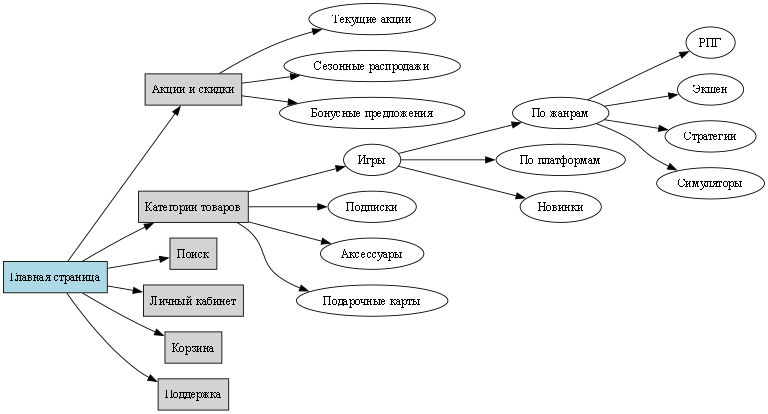

# Процесс создания информационной архитектуры веб-приложения (магазин видеоигр)

## 1. Анализ интерфейса и типы управления

**Тип интерфейса:** веб-приложение с адаптивным дизайном (для десктопа и мобильных устройств).

**Способы управления:**
- Основная навигация через главное меню (категории, поиск).
- Фильтры для удобной сортировки и поиска товаров.
- Интерактивные карточки товаров (добавление в корзину, просмотр информации).
- Чат-поддержка.

## 2. Пример структуры главного меню

- **Главная**
- **Каталог**
- **Рейтинг**
- **Корзина**
- **Профиль**
- **Поддержка**
- **Словарь терминов**

## 3. Каталог

Раздел сайта с товарами, разделенными на категории:
- **Платформа:** система, на которой запускается игра (ПК, консоли, мобильные устройства).
- **Жанр:** тип игры (например, RPG или Экшен).
- **Рейтинг пользователей:** оценки игр, оставленные пользователями.

## 4. Корзина

Виртуальная корзина для добавления выбранных товаров перед покупкой.

## 5. Чат-поддержка

Сервис для связи с техподдержкой в реальном времени.

## 5. Пример карты сайта (блок-схема)

- 
